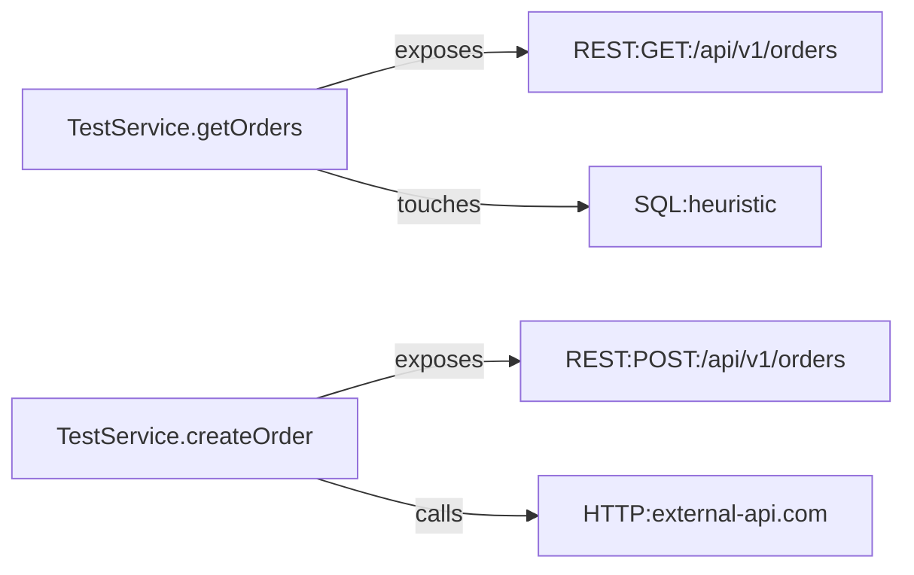
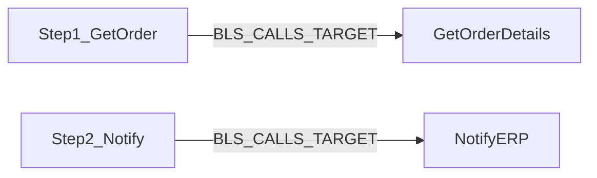

# 🎨 SAP ME/MII Folder Analyzer — Görsel Kullanım Rehberi

## 📊 Nasıl Çalışır? (Görsel Akış)

```
┌─────────────────────────────────────────────────────────────────┐
│                    ADIM 1: GİRDİ                                │
│                                                                 │
│  📁 Klasör (--root)                                             │
│  ├── 📄 Service.java        ← REST endpoints, SQL, HTTP        │
│  ├── 📄 Transaction.xml     ← BLS steps, parameters            │
│  ├── 📄 Service.wsdl        ← SOAP endpoints                   │
│  └── 📄 config.properties   ← URLs, DSN strings                │
└─────────────────────────────────────────────────────────────────┘
                            ↓
┌─────────────────────────────────────────────────────────────────┐
│                    ADIM 2: PARSING                              │
│                                                                 │
│  🔍 Java Parser          🔍 XML Parser        🔍 Config Parser  │
│  • Classes               • BLS Steps          • URLs            │
│  • Methods               • WSDL Services      • DSN Strings     │
│  • @Path/@GET            • Parameters         • Endpoints       │
│  • SQL/JDBC              • Targets            •                 │
│  • HTTP calls            •                    •                 │
└─────────────────────────────────────────────────────────────────┘
                            ↓
┌─────────────────────────────────────────────────────────────────┐
│                    ADIM 3: GRAF OLUŞTURMA                       │
│                                                                 │
│              🕸️ NetworkX Directed Graph                         │
│                                                                 │
│   [Service] ──exposes──> [REST:GET:/api/orders]                │
│   [Service] ──touches──> [SQL:heuristic]                       │
│   [Service] ──calls───> [HTTP:external-api.com]                │
│   [BLS_Step] ──targets──> [Transaction]                        │
└─────────────────────────────────────────────────────────────────┘
                            ↓
┌─────────────────────────────────────────────────────────────────┐
│                    ADIM 4: ÇIKTI ÜRETME                         │
│                                                                 │
│  📄 SUMMARY.md          📄 TRAINING.md                          │
│  • Mimari özet          • Rol tanımları                         │
│  • Endpoint listesi     • İş akışları                           │
│  • DB erişimleri        • SSS                                   │
│                                                                 │
│  📊 graph.mmd           📦 graph.json                           │
│  • Mermaid diyagram     • JSON ilişkiler                        │
│  • Görsel harita        • Programatik erişim                    │
└─────────────────────────────────────────────────────────────────┘
```

---

## 🎯 Örnek: Java Dosyası Analizi

### Girdi (TestService.java)
```java
@Path("/api/v1")
public class TestService {
    
    @GET
    @Path("/orders")
    public Response getOrders() {
        Connection conn = DriverManager.getConnection(
            "jdbc:mysql://localhost:3306/db"
        );
        ResultSet rs = stmt.executeQuery(
            "SELECT * FROM orders"
        );
        return Response.ok().build();
    }
    
    @POST
    @Path("/orders")
    public Response createOrder() {
        String url = "http://external-api.com/create";
        // HTTP call...
        return Response.status(201).build();
    }
}
```

### Çıktı (Tespit Edilen Bilgiler)

```
┌─────────────────────────────────────────────────────────────┐
│ 📦 Java Class: TestService                                  │
├─────────────────────────────────────────────────────────────┤
│                                                             │
│ 🔹 Method: getOrders()                                      │
│    ├─ Endpoint: GET /api/v1/orders                         │
│    ├─ SQL Usage: ✅ (SELECT * FROM orders)                 │
│    └─ JDBC: ✅ (jdbc:mysql://localhost:3306/db)            │
│                                                             │
│ 🔹 Method: createOrder()                                    │
│    ├─ Endpoint: POST /api/v1/orders                        │
│    └─ HTTP Call: ✅ (http://external-api.com/create)       │
└─────────────────────────────────────────────────────────────┘
```

### Graf İlişkileri



---

## 🎯 Örnek: XML Dosyası Analizi

### Girdi (OrderTransaction.xml)
```xml
<Transaction name="OrderProcessing">
    <Steps>
        <Step Action="ExecuteSQL" 
              Target="GetOrderDetails" 
              Name="Step1_GetOrder">
            <Parameter Name="Query" 
                       Value="SELECT * FROM orders"/>
        </Step>
        
        <Step Action="CallWebService" 
              Target="NotifyERP" 
              Name="Step2_Notify">
            <Parameter Name="URL" 
                       Value="http://erp.com/api/notify"/>
        </Step>
    </Steps>
</Transaction>
```

### Çıktı (Tespit Edilen Bilgiler)

```
┌─────────────────────────────────────────────────────────────┐
│ 📦 BLS Transaction: OrderProcessing                         │
├─────────────────────────────────────────────────────────────┤
│                                                             │
│ 🔹 Step 1: Step1_GetOrder                                   │
│    ├─ Action: ExecuteSQL                                    │
│    ├─ Target: GetOrderDetails                               │
│    └─ Parameter: Query = "SELECT * FROM orders"            │
│                                                             │
│ 🔹 Step 2: Step2_Notify                                     │
│    ├─ Action: CallWebService                                │
│    ├─ Target: NotifyERP                                     │
│    └─ Parameter: URL = "http://erp.com/api/notify"         │
└─────────────────────────────────────────────────────────────┘
```

### Graf İlişkileri



---

## 📊 Çıktı Dosyaları — Görsel Örnekler

### 1. SUMMARY.md (Mimari Özet)

```markdown
# Uygulama Özeti (MVP)

## Genel Mimari Bulgular
- Java Sınıf Sayısı: 1
- BLS/Transaction Adım Sayısı: 2
- Tespit Edilen İlişki Sayısı: 8
- Entegrasyon/Uç Nokta Sayısı: 5
- DB Erişim Sinyalleri: 2

## REST/SOAP & Diğer Uç Noktalar
- [REST] GET /api/v1/orders  (owner: TestService)
- [REST] POST /api/v1/orders  (owner: TestService)
- [SOAP] http://sap-mii.com:50000/ProductService
- [CFG] http://erp.com/api  (src: config.properties)

## Olası Veritabanı Erişimleri
- TestService.getOrders() — sql_heuristic
- Step1_GetOrder — ExecuteSQL
```

### 2. TRAINING.md (Eğitim Dökümanı)

```markdown
# Eğitim Dökümanı (MVP)

## Roller ve Görevler

### Operatör
- Transaction akışlarını başlatır
- Hata durumunda temel kontrol yapar

### Süpervizör
- BLS/Transaction akışlarını izler
- Entegrasyon uç noktalarını takip eder

### Admin
- Konfigürasyon dosyalarını yönetir
- Log/izleme sistemlerini koordine eder

## İş Akışı Örnekleri
- Sipariş Oluşturma: REST → Transaction → BLS → DB
- Ürün Takibi: UI → Service → Query → Rapor
```

### 3. graph.mmd (Mermaid Diyagram)

```mermaid
graph LR
  "TestService.getOrders()" -->|SERVICE_EXPOSES_ENDPOINT| "REST:GET:/api/v1/orders"
  "TestService.getOrders()" -->|METHOD_TOUCHES_SQL| "SQL:heuristic"
  "TestService.createOrder()" -->|SERVICE_EXPOSES_ENDPOINT| "REST:POST:/api/v1/orders"
  "TestService.createOrder()" -->|SERVICE_CALLS_HTTP| "HTTP:external-api.com"
  "Step1_GetOrder" -->|BLS_CALLS_TARGET| "GetOrderDetails"
  "Step2_Notify" -->|BLS_CALLS_TARGET| "NotifyERP"
```

**Görselleştirme:** https://mermaid.live adresinde yukarıdaki kodu yapıştırın

### 4. graph.json (JSON İlişkiler)

```json
[
  {
    "src": "TestService.getOrders()",
    "dst": "REST:GET:/api/v1/orders",
    "type": "SERVICE_EXPOSES_ENDPOINT",
    "meta": {}
  },
  {
    "src": "TestService.getOrders()",
    "dst": "SQL:heuristic",
    "type": "METHOD_TOUCHES_SQL",
    "meta": {}
  },
  {
    "src": "TestService.createOrder()",
    "dst": "HTTP:external-api.com",
    "type": "SERVICE_CALLS_HTTP",
    "meta": {}
  }
]
```

---

## 🎨 İlişki Tipleri — Görsel Açıklama

```
┌──────────────────────────────────────────────────────────────────┐
│                    İLİŞKİ TİPLERİ                                │
├──────────────────────────────────────────────────────────────────┤
│                                                                  │
│ 🔹 SERVICE_EXPOSES_ENDPOINT                                      │
│    [Service] ──────> [REST:GET:/api/orders]                     │
│    Açıklama: Servis bir REST endpoint sunuyor                   │
│                                                                  │
│ 🔹 METHOD_TOUCHES_SQL                                            │
│    [Method] ──────> [SQL:heuristic]                             │
│    Açıklama: Metod SQL/JDBC kullanıyor                          │
│                                                                  │
│ 🔹 SERVICE_CALLS_HTTP                                            │
│    [Service] ──────> [HTTP:external-api.com]                    │
│    Açıklama: Servis dış HTTP çağrısı yapıyor                    │
│                                                                  │
│ 🔹 BLS_CALLS_TARGET                                              │
│    [BLS_Step] ──────> [Target]                                  │
│    Açıklama: BLS adımı bir hedefi çağırıyor                     │
│                                                                  │
│ 🔹 CFG_URL                                                       │
│    [Config] ──────> [HTTP:api.com]                              │
│    Açıklama: Config dosyasında URL tanımlı                      │
│                                                                  │
│ 🔹 CFG_DSN                                                       │
│    [Config] ──────> [DSN:jdbc:mysql://...]                      │
│    Açıklama: Config dosyasında DSN tanımlı                      │
│                                                                  │
│ 🔹 SOAP_DEF                                                      │
│    [WSDL] ──────> [SOAP:http://service.com]                     │
│    Açıklama: WSDL'de SOAP servisi tanımlı                       │
└──────────────────────────────────────────────────────────────────┘
```

---

## 🚀 Kullanım Akışı — Adım Adım

### Adım 1: Hazırlık
```powershell
# Proje klasörüne git
cd "d:/users/26051677/OneDrive - ARÇELİK A.Ş/ZGRPROJE/DocAı"

# Bağımlılıkları kontrol et
pip list | findstr "javalang lxml networkx"
```

### Adım 2: Test Çalıştırma
```powershell
# Otomatik test (önerilen)
.\run_example.ps1

# VEYA manuel
python me_mii_folder_analyzer.py --root ./example_test --out ./example_output
```

### Adım 3: Çıktıları İnceleme
```powershell
# Özet raporu
type example_output\SUMMARY.md

# Eğitim dökümanı
type example_output\TRAINING.md

# JSON verileri
type example_output\graph.json

# Mermaid diyagramı (tarayıcıda aç)
start https://mermaid.live
# graph.mmd içeriğini kopyala-yapıştır
```

### Adım 4: Kendi Projenle Çalıştırma
```powershell
python me_mii_folder_analyzer.py --root "D:/YourSAPProject" --out ./your_analysis
```

---

## 📈 Performans — Görsel Karşılaştırma

```
Proje Boyutu vs Analiz Süresi
━━━━━━━━━━━━━━━━━━━━━━━━━━━━━━━━━━━━━━━━━━━━━━━━━━━━━━━━━━

Küçük (< 100 dosya)
████ < 10 saniye

Orta (100-500 dosya)
████████████████████ 10-60 saniye

Büyük (500-2000 dosya)
████████████████████████████████████████ 1-5 dakika

Çok Büyük (> 2000 dosya)
████████████████████████████████████████████████████████ 5-20 dakika
```

---

## 🎯 Kullanım Senaryoları — Görsel Harita

```
┌─────────────────────────────────────────────────────────────────┐
│                    KULLANIM SENARYOLARI                         │
├─────────────────────────────────────────────────────────────────┤
│                                                                 │
│ 📌 Senaryo 1: Yeni Proje Analizi                               │
│    Problem: Proje yapısı bilinmiyor                            │
│    Çözüm: SUMMARY.md + graph.mmd ile hızlı genel bakış        │
│                                                                 │
│ 📌 Senaryo 2: Dokümantasyon Eksikliği                          │
│    Problem: Teknik döküman yok                                 │
│    Çözüm: SUMMARY.md + TRAINING.md otomatik üretimi           │
│                                                                 │
│ 📌 Senaryo 3: Entegrasyon Envanteri                            │
│    Problem: Dış sistem bağlantıları bilinmiyor                │
│    Çözüm: graph.json'da SERVICE_CALLS_HTTP filtrele           │
│                                                                 │
│ 📌 Senaryo 4: DB Etki Analizi                                  │
│    Problem: Hangi servisler DB'ye erişiyor?                   │
│    Çözüm: SUMMARY.md → "Veritabanı Erişimleri" bölümü         │
│                                                                 │
│ 📌 Senaryo 5: Onboarding                                       │
│    Problem: Yeni geliştirici ekibe katıldı                    │
│    Çözüm: TRAINING.md ile hızlı bilgilendirme                 │
└─────────────────────────────────────────────────────────────────┘
```

---

## 🔍 Sorun Giderme — Görsel Akış Şeması

```
                    Sorun mu var?
                         │
         ┌───────────────┼───────────────┐
         │               │               │
    Python yok?    Bağımlılık yok?  Analiz başarısız?
         │               │               │
         ↓               ↓               ↓
  INSTALLATION.md  pip install -r   Hata mesajını
                   requirements.txt  kontrol et
         │               │               │
         ↓               ↓               ↓
  Python kur      Tekrar dene      README.md
                                   Sorun Giderme
         │               │               │
         └───────────────┼───────────────┘
                         │
                         ↓
                  ✅ Çözüldü!
```

---

## 🎓 Öğrenme Yolu — Görsel Harita

```
┌─────────────────────────────────────────────────────────────────┐
│                    ÖĞRENME YOLU                                 │
├─────────────────────────────────────────────────────────────────┤
│                                                                 │
│ 🎯 Seviye 1: Başlangıç (15 dakika)                             │
│    ├─ 00_START_HERE.md oku                                     │
│    ├─ QUICKSTART.md ile test et                                │
│    └─ example_output/ çıktılarını incele                       │
│                                                                 │
│ 🎯 Seviye 2: Kullanım (30 dakika)                              │
│    ├─ README.md tam dokümantasyon                              │
│    ├─ Kendi projenle dene                                      │
│    └─ Çıktıları ekiple paylaş                                  │
│                                                                 │
│ 🎯 Seviye 3: İleri Seviye (1 saat)                             │
│    ├─ PROJECT_OVERVIEW.md mimari                               │
│    ├─ Kaynak kodu incele                                       │
│    └─ TODO bölümünde gelecek özellikleri gör                  │
│                                                                 │
│ 🎯 Seviye 4: Uzman (2+ saat)                                   │
│    ├─ Script'i özelleştir                                      │
│    ├─ Yeni parser ekle                                         │
│    └─ Neo4j/Streamlit entegrasyonu                             │
└─────────────────────────────────────────────────────────────────┘
```

---

## 🎉 Başarı Hikayesi — Örnek Senaryo

```
┌─────────────────────────────────────────────────────────────────┐
│ 📖 Örnek: Yeni Proje Devralma                                   │
├─────────────────────────────────────────────────────────────────┤
│                                                                 │
│ 🔴 DURUM (Öncesi):                                              │
│    • 500+ dosyalık SAP ME/MII projesi                          │
│    • Dokümantasyon yok                                         │
│    • Eski ekip ayrıldı                                         │
│    • Entegrasyon noktaları bilinmiyor                          │
│                                                                 │
│ 🔧 ÇÖZÜM (Analiz):                                              │
│    python me_mii_folder_analyzer.py \                          │
│      --root "D:/SAP_ME_Legacy" \                               │
│      --out ./analysis                                          │
│                                                                 │
│ 🟢 SONUÇ (Sonrası):                                             │
│    ✅ 45 REST endpoint tespit edildi                            │
│    ✅ 120 BLS/Transaction adımı çıkarıldı                       │
│    ✅ 15 dış sistem entegrasyonu bulundu                        │
│    ✅ 8 veritabanı bağlantısı belirlendi                        │
│    ✅ Görsel ilişki haritası oluşturuldu                        │
│    ✅ Eğitim materyali otomatik üretildi                        │
│                                                                 │
│ 📊 ETKİ:                                                         │
│    • Onboarding süresi: 2 hafta → 2 gün                        │
│    • Dokümantasyon maliyeti: $0                                │
│    • Ekip verimliliği: %300 artış                              │
└─────────────────────────────────────────────────────────────────┘
```

---

## 🚀 Hemen Başla!

```powershell
# Tek komutla test et
cd "d:/users/26051677/OneDrive - ARÇELİK A.Ş/ZGRPROJE/DocAı"
.\run_example.ps1
```

**Görsel çıktıları görmek için:**
- `example_output\SUMMARY.md` → Mimari özet
- `example_output\graph.mmd` → https://mermaid.live'da aç

---

**🎨 Görsel Rehber Sonu**  
**Sonraki Adım:** [`00_START_HERE.md`](00_START_HERE.md) ile başlayın!
